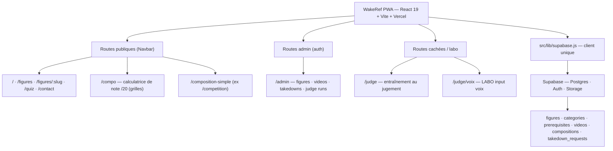
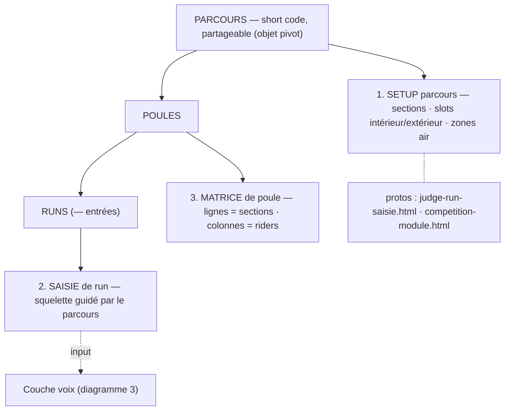
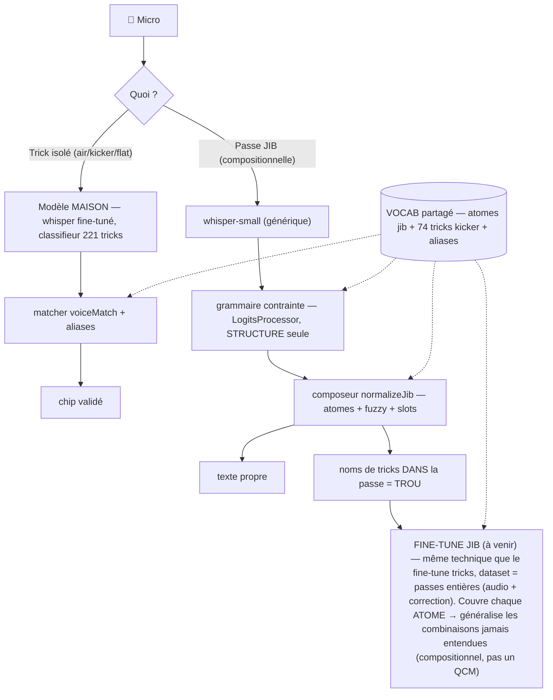

# Architecture WakeRef — vue d'ensemble

Trois schémas : le site existant, le module compétition (conçu), et l'input voix.
Rendu Mermaid (IntelliJ / GitHub). Version ASCII : voir aussi le fil de discussion.

---

## 1. Site existant (live)

---

## 2. Module compétition (conçu, pas encore codé en React)

---

## 3. Input voix (labo /judge/voix ; alimentera la saisie compèt)

---

**Fils conducteurs**

- **2 couches** : (1) *comment tu juges* = module compétition ; (2) *comment tu captes* = input voix. La saisie du module **consomme** l'input voix.
- **2 modèles voix**, **même technique de fine-tune** (whisper séquence-à-séquence), **datasets différents** : le **maison** (sur whisper-base) n'a vu que des tricks isolés → se comporte *de facto* comme un classifieur mono-trick (air/kicker/flat) ; le **jib** (à venir, sur whisper-small) verra des passes entières → transcripteur compositionnel. La différence est cuite dans le dataset, pas dans l'algorithme.
- **1 colonne vertébrale** : le `VOCAB` (atomes + 74 tricks + aliases) sert le matcher, le composeur, la grammaire, et bientôt les labels du fine-tune. Construit une fois, réutilisé partout.
- **Le seul trou** : les noms de tricks *dans* une passe jib → fine-tune jib (collecte à lancer).
